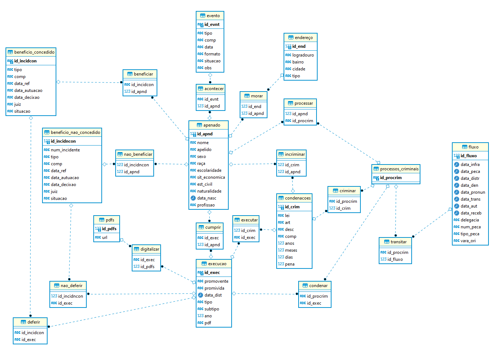

```{r, include = FALSE}
knitr::opts_chunk$set(
  collapse = TRUE,
  message = FALSE,
  error = FALSE
)

```

## Setup

```{r setup}
library(DBI)
library(usethis)
library(tidyverse)
library(cowplot)
devtools::load_all()
```

## Diagrama da base

{width="567"}

## Perguntas

### 1) Quantas pessoas foram condenadas por homicídio? Tanto o simples quanto o qualificado

O caminho para responder esta pergunta envolve recuperar todas as condenações, juntar com os apenados e filtrar para as condenações no art. 121, com exclusão daqueles na modalidade culposa

```{r}
con <- conectar() #base postgres
q <- "SELECT COUNT(DISTINCT id_apnd) FROM apenado
INNER JOIN incriminar
USING (id_apnd)
INNER JOIN condenacoes
USING (id_crim)
WHERE condenacoes.art = 'ART 121: Matar alguem:' AND
condenacoes.descr NOT LIKE '%Culposo%'"
dbGetQuery(con, q)
```

Tá aí a resposta. 14.058 pessoas condenadas por homicídios que estão registradas no sistema de execução penal do PROJUDI. Apenas à título de contexto numérico, o ISP registra uma média de 5.000 vítimas de homicídio doloso a cada ano - claro que há diferenças entre os dois números. Um mesmo condenado por homicídio pode ter sido responsável por mais de um homicídio.

### 2) Mas quantos processos de execução penal por crime de homicídio houveram a cada ano?

Começando com o *query*, que envolve pegar os casos distintos de id de execução e ano, filtrado para homicídios:

```{r}
q <- "SELECT DISTINCT id_exec, ano FROM execucao
INNER JOIN executar
USING (id_exec)
INNER JOIN condenacoes
USING (id_crim)
WHERE condenacoes.art = 'ART 121: Matar alguem:' AND
condenacoes.descr NOT LIKE '%Culposo%'"
res <- dbGetQuery(con, q)

```

Ao todo, são 14.094 execuções penais por homicídios - 36 execuções a mais que o número de apenados por homicídio, o que mostra que há apenados com mais de uma execução.

Todavia, não necessariamente de pena privativa de liberdade. Há vários subtipos de execução, como pode ser vistos abaixo

```{r}
execs %>% select(tipo, subtipo) %>% distinct()
```

Como uma diferença de 36 perto de 14.000 não é lá tanta coisa, vamos fingir que está tudo bem. Plotando o número de processos de execução por ano, temos o seguinte:

```{r}
exec_ano <- res %>% group_by(ano) %>% 
  count()
ggplot(exec_ano, aes(y = n, x = ano)) +
  geom_line() +
  cowplot::theme_minimal_hgrid()
```

Uma clara tendência de crescimento após 1980. Vamos ver de quanto é

```{r}
exec_ano80_20 <- exec_ano %>% filter( ano >= 1980) %>% ungroup() %>% 
  mutate(ano2 = ano - min(ano))
summary(lm(n ~ ano2, data = exec_ano80_20))

```

Em 1980, tínhamos um valor inicial de cerca de 90 condenados po homicídios. A cada ano, esse valor aumento, em média, 13,21.

### 3) E quantos destes 14.058 condenados por homicídios nós temos o processo digitalizado?

Parecido com o primeiro *query,* mas sem o *count* e com uns *joins* a mais

```{r}
q <- "SELECT DISTINCT id_apnd, nome, pdfs.url 
FROM apenado
INNER JOIN incriminar
USING (id_apnd)
INNER JOIN condenacoes
USING (id_crim)
INNER JOIN cumprir
USING (id_apnd)
INNER JOIN execucao
USING (id_exec)
LEFT JOIN digitalizar
USING (id_exec)
LEFT JOIN pdfs
USING (id_pdfs)
WHERE condenacoes.art = 'ART 121: Matar alguem:' AND
condenacoes.descr NOT LIKE '%Culposo%'"
res <- dbGetQuery(con, q)
```

Seja lá por que diabos, desta vez o total 14.085 - mas ainda são 14.058 ids únicos de apenados. Ou seja, tem umas duplicatas aí. Desta vez, por causa da única variável adicionada: a url.

Feitas estas ressalvas, temos:

```{r}
nas <- res %>% mutate(tem_pdf = if_else(is.na(url), 0, 1)) %>% 
  mutate(tem_pdf = as.logical(tem_pdf)) %>% 
  group_by(tem_pdf) %>% 
  count() %>% 
  ungroup() %>% 
  mutate(prop = (n/sum(n)) %>% round(2))
nas
```

Uns 52% tem pdf, o resto não tem. Esses 52% dão cerca de 7.306 casos - "cerca de" por causa das imprecisões entre número de apenados e número de execuções digitalizadas.

### 4) Mas como esses processos digitalizados e não digitalizados se distribuem ao longo do ano?

A idéia aqui é ver mais ou menos quando o PROJUDI ficou mais robusto enquanto procedimento. Quanto entrou pra rotina.

```{r}
q <- "SELECT DISTINCT id_apnd, nome, pdfs.url, execucao.ano
FROM apenado
INNER JOIN incriminar
USING (id_apnd)
INNER JOIN condenacoes
USING (id_crim)
INNER JOIN cumprir
USING (id_apnd)
INNER JOIN execucao
USING (id_exec)
LEFT JOIN digitalizar
USING (id_exec)
LEFT JOIN pdfs
USING (id_pdfs)
WHERE condenacoes.art = 'ART 121: Matar alguem:' AND
condenacoes.descr NOT LIKE '%Culposo%'"
res <- dbGetQuery(con, q) %>% 
  mutate(tem_pdf = if_else(is.na(url), 0, 1)) %>% 
  mutate(tem_pdf = as.logical(tem_pdf)) %>% 
  group_by(ano) %>% 
  summarise(n_com = sum(tem_pdf),
            n_total = n(),
            n_sem = n_total - n_com) %>% 
  ungroup() %>% 
  mutate(prop_com = (n_com/n_total) %>% round(2),
         prop_sem = (n_sem/n_total) %>% round(2))
res
```

E vamos ao gráfico (com pdf está em azul, sem em vermelho)

```{r}
ggplot(res, aes(y = prop_com, x = ano)) +
  geom_line(col = "blue") + geom_line(aes(y = prop_sem), inherit.aes = T, col = "red") +
  theme_minimal_hgrid()
```

A inversão se dá em 2002. Os primeiros processos de homicídios digitalizados, no todo ou em parte, datam de dois anos antes. A partir de 2012, são mais de 86% dos processos digitalizados - 89%, se contarmos a partir de 2013. Se regredirmos para abaixo de 2012, essa proporção cai e vai varia entre 70 e 74%, contando a partir de 2008 - depois cai para o patamar dos 60%.
